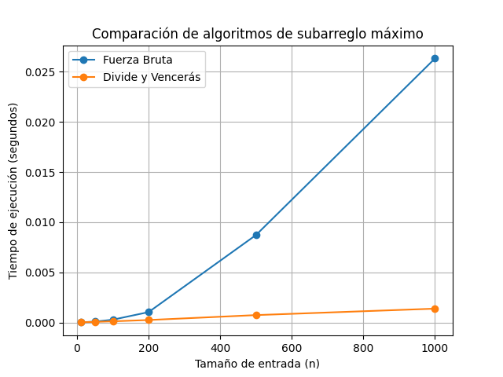
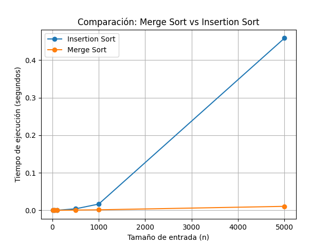

# Laboratorio #1 - Algoritmos (Recursividad, Divide y Vencerás, Merge Sort)

---

## INFORMACIÓN GENERAL

**Presentado por:** Miguel Angel Rios Ochoa  
**Materia:** Analisis de algoritmos  
**Código clase:** 190304006-1  
**Profesor:** SANTIAGO SUAREZ CORTES  
**Universidad:** Instituto tecnológico metropolitano (I.T.M)  
**Facultad:** Ingenierías  
**Tema:** Recursividad, Divide y Vencerás, Merge Sort  
**Fecha limite:** 18-04-2026  

---

## INTRODUCCIÓN

En este laboratorio evidenciaremos con claridad que la recursividad y el paradigma de divide y vencerás son unos conceptos fundamentales para el análisis y el diseño de algoritmos. La recursividad consiste en la capacidad de que un algoritmo pueda llamarse a sí mismo para resolver un problema, descomponiendose en instancias mucho más pequeñas hasta alcanzar un caso base para detener el proceso, teniendo en cuenta que este caso base debe ser definido con cuidado ya que sin este se causan bucles infinitos.

Por otro lado, el paradigma de divide y vencerás se basa en dividir un problema muy complejo en subproblemas mucho más simples del mismo tipo. Esto para resolverlos de manera independiente y luego combinar sus soluciones para obtener el resultado final. Este enfoque es ampliamente utilizado en los algoritmos más eficientes; como los de ordenamiento y búsqueda.

Por lo tanto, podemos decir con certeza que ambos conceptos son esenciales porque permiten el desarrollo de soluciones más claras, estructuradas y, en la mayoria de los casos, más eficientes, facilitando la resolución de problemas complejos.

---

## PREGUNTAS

### 1. La recursividad es:
a) Un algoritmo iterativo  
b) Un algoritmo que usa  ́unicamente ciclos  
c) Un algoritmo que se llama a sí mismo  
d) Un algoritmo que no tiene caso base  

### 2. El caso base en un algoritmo recursivo permite:
a) Aumentar la complejidad del algoritmo  
b) Detener la ejecución de la recursión  
c) Duplicar las llamadas recursivas  
d) Eliminar estructuras iterativas  

### 3. ¿Cuál es una desventaja de la recursividad?
a) No puede expresar problemas matemáticos  
b) Puede consumir más memoria  
c) Siempre es más rápida que un ciclo  
d) No puede retornar valores  

### 4. El paradigma divide y vencerás consiste en:
a) Resolver el problema utilizando ciclos anidados  
b) Dividir el problema en subproblemas más pequeños, resolverlos y combinar sus soluciones  
c) Ordenar los datos antes de procesarlos  
d) Aplicar programación dinámica  

### 5. En el problema del máximo subarreglo, ¿cuántos casos posibles existen al dividir el arreglo mediante el paradigma divide y vencerás? Enuncie cada caso
a) 2  
b) 3  
c) 4  
d) 5  

### 6. En Merge Sort y el problema del máximo subarreglo, ¿Cuál es el caso base de los algoritmos?
a) Cuando el arreglo tiene dos elementos  
b) Cuando el arreglo tiene un elemento  
c) Cuando el arreglo tiene un negativo  
d) Cuando el arreglo es positivo  

### 7. La complejidad temporal del algoritmo Merge Sort es:
a) O(n)  
b) O(n^2)  
c) O(n log n)  
d) O(log n)  

### 8. El problema del subarreglo máximo busca:
a) El elemento más grande del arreglo  
b) El subarreglo con mayor número de elementos  
c) El subarreglo contiguo cuya suma es máxima  
d) El promedio m ́as alto del arreglo  

### 9. El algoritmo Insertion Sort pertenece a la categoría de algoritmos:
a) Divide y vencerás  
b) Iterativos con complejidad cuadrática  
c) Logarítmicos  
d) Recursivos puros  

### 10. En el paradigma divide y vencerás, el problema original se resuelve:
a) Eliminando subproblemas innecesarios  
b) Transformándolo en subproblemas más pequeños del mismo tipo  
c) Ordenando previamente los datos  
d) Aplicando programación dinámica  

---

## RESPUESTAS

### 1. La recursividad es:
c) Un algoritmo que se llama a sí mismo

### 2. El caso base en un algoritmo recursivo permite:
b) Detener la ejecución de la recursión

### 3. ¿Cuál es una desventaja de la recursividad?
b) Puede consumir más memoria

### 4. El paradigma divide y vencerás consiste en:
b) Dividir el problema en subproblemas más pequeños, resolverlos y combinar sus soluciones

### 5. En el problema del máximo subarreglo, ¿cuántos casos posibles existen al dividir el arreglo mediante el paradigma divide y vencerás? Enuncie cada caso
b) 3  
CASOS:  
    Completamente en la mitad izquierda  
    Completamente en la mitad derecha  
    Cruzando el punto medio.  

### 6. En Merge Sort y el problema del máximo subarreglo, ¿Cuál es el caso base de los algoritmos?
b) Cuando el arreglo tiene un elemento

### 7. La complejidad temporal del algoritmo Merge Sort es:
c) O(n log n)

### 8. El problema del subarreglo máximo busca:
c) El subarreglo contiguo cuya suma es máxima

### 9. El algoritmo Insertion Sort pertenece a la categoría de algoritmos:
b) Iterativos con complejidad cuadrática

### 10. En el paradigma divide y vencerás, el problema original se resuelve:
b) Transformándolo en subproblemas más pequeños del mismo tipo

---

## DESARROLLO DE LOS DIAGRAMAS DE LOS ALGORITMOS

### Construcción de Arreglos

    Para el desarrollo del laboratorio, se construyen dos arreglos a partir de los dígitos del número de identificación.

#### Reglas generales

* Se toman todos los dígitos del documento.  
* Los ceros deben reemplazarse por el último dígito del documento.  
* Si el último dígito también es cero, se utiliza el penúltimo, y así sucesivamente.  

#### Arreglo 1 (Subarreglo Máximo)
    Se construye alternando signos positivos y negativos en cada posición.  

    Ejemplo:  
    Documento: 1035972481  

    Arreglo:  
    [1, -1, 3, -5, 9, -7, 2, -4, 8, -1]  

#### Arreglo 2 (Ordenamiento)
    Se construye con los mismos dígitos del documento, sin modificar el signo.  

    Ejemplo:  

    [1, 1, 3, 5, 9, 7, 2, 4, 8, 1]  

### Ejercicio 1: Solucion manual del problema del subarreglo máximo
Solución desarrollada en el archivo AlgoritmosManual.md  

### Ejercicio 2: Solución manual del algoritmo Merge Sort
Solución desarrollada en el archivo AlgoritmosManual.md  

### Ejercicio 3: Implementación en Python del problema del subarreglo máximo
Solución desarrollada en el archivo Ejercicio 2.4.py  

### Ejercicio 4: Comparación experimental entre Merge Sort e Insertion Sort
Solución desarrollada en el archivo Ejercicio 2.5.py  

---

## Resultados experimentales

### Fuerza bruta vs Divide y vencerás
A continuación se muestra la gráfica comparativa de tiempos de ejecución entre el algoritmo de fuerza bruta y el algoritmo de divide y vencerás:  

#### Mis observaciones de la gráfica:
* El algoritmo de fuerza bruta presenta un crecimiento acelerado en el tiempo de ejecución a medida que aumenta el tamaño de entrada, debido a su complejidad O(n²).  
* El algoritmo de divide y vencerás muestra un crecimiento mucho más controlado, acorde a su complejidad O(n log n).  
* Para valores pequeños de n, ambos algoritmos tienen tiempos similares, aunque es más rápido el brute force pero minimamente.  
* A medida que n crece, la diferencia de rendimiento se vuelve significativa  

### Insertion sort vs Merge sort
A continuación se muestra la gráfica comparativa de tiempos de ejecución entre los algoritmos de ordenamiento Insertion sort y Merge Sort:  

#### Mis observaciones de la gráfica:
* Insertion Sort presenta un crecimiento cuadrático O(n²), por lo que su tiempo aumenta rápidamente.  
* Merge Sort tiene una complejidad O(n log n), mostrando un crecimiento mucho más eficiente  
* Para valores pequeños de n, ambos algoritmos tienen tiempos similares.  
* Para valores grandes (n ≥ 1000), Merge Sort es significativamente más rápido.  

---

## Conclusiones

A partir de los ejercicios realizados en el taller y en clase, hemos podido evidenciar una relación muy directa entre el comportamiento práctico de los algoritmos y su complejidad teórica.  
En el problema del subarreglo máximo, el algoritmo de fuerza bruta presentó un crecimiento acelerado en el tiempo de ejecución, lo cual concuerda con su complejidad O(n²). Por otro lado, el algoritmo basado en divide y vencerás mostró un mejor desempeño a medida que el tamaño de entrada aumentaba, reflejando su complejidad O(n log n).  
De manera similar, en la comparación entre Merge Sort e Insertion Sort, se observó que Insertion Sort funciona de manera aceptable para arreglos pequeños, pero su rendimiento se degrada rápidamente al aumentar el tamaño de los datos, debido a su complejidad cuadrática O(n²). Pero por otro lado, Merge Sort mantiene un crecimiento más estable y eficiente, lo que lo hace más adecuado para manejar grandes volúmenes de información.  

Los resultados experimentales obtenidos mediante la medición de tiempos y su representación gráfica me permiten confirmar que los algoritmos con menor complejidad teórica escalan muchisimo mejor y con mucha más eficiencia en escenarios reales que contengan grandes volumenes de información.  

En conclusión, con este análisis podemos demostrar lo sumamente importante que es elegir adecuadamente el algoritmo según el tamaño del problema, ya que una mala elección puede afectar significativamente el rendimiento del sistema.  

---